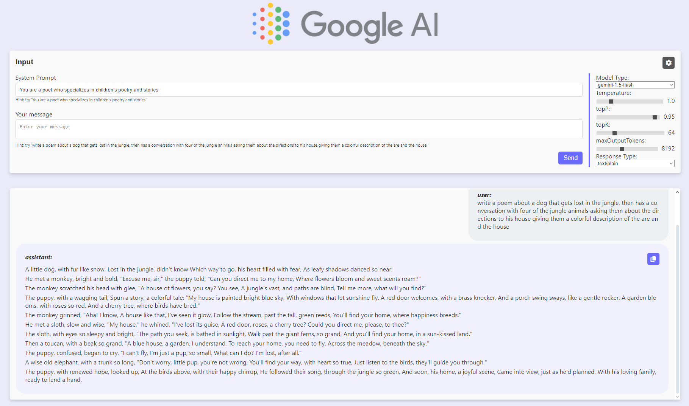

<h1 align="center">
  React Dashboard for connecting with Google AI Studio API
</h1>

<!-- <p align="center">
  <a href="https://github.com/SafdarJamal/vite-template-react/releases">
    
  </a>
  <a href="https://github.com/SafdarJamal/vite-template-react/blob/main/LICENSE">
    
  </a>
</p> -->

<p align="center">
    A <a href="https://vitejs.dev">Vite</a> + <a href="https://react.dev">React</a> + <a href="https://ai.google.dev/aistudio">Google AI Studio</a> project
</p>




## Development

To get a local copy of the code, clone it using git:

```
git clone https://github.com/alaaet/react-google-generative-ai
cd react-google-generative-ai
```

Make it your own:

```
rm -rf .git && git init && npm init
git add .
git commit -m "Initial commit"
```

Install dependencies:

```
npm i
```
create your .env file with the following variable:
```
VITE_GEMINI_API_KEY=***********_****************************
```
<b>give it your API key that you can get from [here](https://aistudio.google.com/app/apikey)</b>

----------------------

Now, you can start a local web server by running:

```
npm start
```

And then open http://localhost:3000 to view it in the browser.

#### Available Scripts

In this project, you can run the following scripts:

| Script        | Description                                             |
| ------------- | ------------------------------------------------------- |
| npm start     | Runs the app in the development mode.                   |
| npm test      | Launches the test runner in the interactive watch mode. |
| npm run build | Builds the app for production to the `dist` folder.     |
| npm run serve | Serves the production build from the `dist` folder.     |

## Credits

This React Google Generative AI is built and maintained by [Alaa Abuiteiwi](https://alaaet.com).

## License

This project is licensed under the terms of the [MIT license](https://github.com/alaaet/react-google-generative-ai/blob/main/LICENSE).
